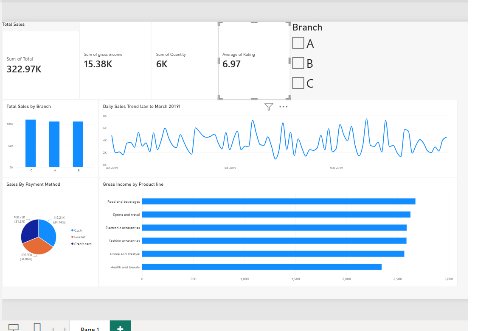

# Supermarket Sales Dashboard (Power BI)

An exploratory dashboard built in Power BI on a 1,000-row supermarket sales dataset (Branches A, B, C; Jan to Mar 2019).

## KPIs
- Total sales: 322.97K
- Gross income: 15.38K
- Quantity sold: about 6K units
- Average customer rating: 6.97 / 10

## Visuals
- Total sales by branch (column chart)
- Daily sales trend (line chart)
- Sales by payment method (pie chart)
- Gross income by product line (bar chart)
- Branch slicer to filter the whole page

## Key observations
- Sales are spread fairly evenly across the three branches.
- Daily sales fluctuate steadily with no strong upward or downward trend over the three months.
- Food and beverages and Sports and travel earn the most gross income; Health and beauty earns the least.
- The three payment methods (Cash, Ewallet, Credit card) are used in similar proportions.

## Tools
Power BI Desktop

## Files
- `SupermarketSales_EDa.pbix`: the Power BI report
- `dashboard.png`: dashboard screenshot# supermarket_sales_powerbi_dashboard
